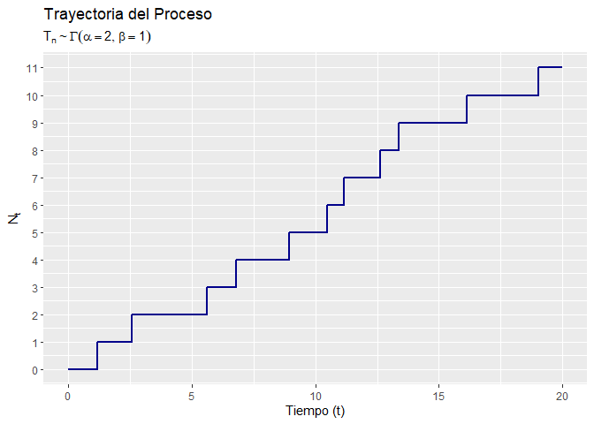
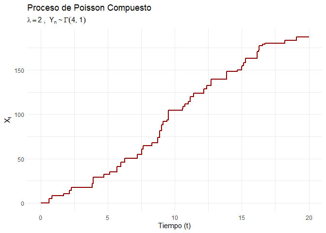

Tarea de Programación I
================
José Jorge Martínez de la Cruz
2026-03-04

## 1. Proceso de Renovación

El objetivo de esta sección es simular trayectorias de un proceso de
renovación. En este proceso, los tiempos de interarribo $T_{n}$ son
variables aleatorias independientes e idénticamente distribuidas. Los
tiempos de arribo $W_{n}$ se definen como:
$$W_{n} = \sum_{i=1}^{n} T_{i}$$

Con eso en mente, implementamos una función que usará la función
‘cumsum()’ que va sumando progresivamente cada número con el acumulado
de los anteriores en una lista de la forma ‘c(a, b, …,)’. La función
recibe el tiempo final $t$ y cualquier familia de densidades conocida
que R acepte como una generadora de números aleatorios (junto con sus
parámetros) para simular los tiempos de interarribo.

``` r
# Creamos la función para simular el proceso de renovación
simular_renovacion <- function(t_final, rdist, ...) {
  W_n <- numeric(0) #Creamos los tiempos de arribo
  tiempo_actual <- 0
  
  # Generamos los tiempos en secciones o bloques porque es más eficiente
  while(tiempo_actual < t_final) {
    # Generamos un bloque de 200 tiempos 
    T_n <- rdist(200, ...) 
    nuevos_W <- tiempo_actual + cumsum(T_n) #Aquí la función
    W_n <- c(W_n, nuevos_W)
    
    # Actualizamos el tiempo actual al último arribo generado
    tiempo_actual <- tail(W_n, 1)
  }
  
  # Filtramos estrictamente los tiempos que ocurrieron antes de t_final
  W_n <- W_n[W_n <= t_final]
  
  return(W_n)
}
```

### Verificación: Teorema Elemental de Renovación

El Teorema Elemental de Renovación nos dice que para un proceso de
renovación donde $\mu = E[T_{n}]$ y donde $0 < \mu < \infty$, se tiene
que: $$\lim_{t \to \infty} \frac{N_{t}}{t} = \frac{1}{\mu}, c.s.$$

Para verificarlo, simularemos un proceso con
$T_{n} \sim \Gamma(\alpha = 2, \beta = 1)$ hasta un tiempo $t$ muy
grande ($t = 50,000$). En este caso, la esperanza es
$\mu = \alpha / \beta = 2$, por lo que el límite teórico es $1/2 = 0.5$.

``` r
# Parámetros de la distribución Gamma
alpha_param <- 2
beta_param <- 1 # rate
mu <- alpha_param / beta_param

# Simulamos para un t muy grande
t <- 50000
set.seed(236) # Para reproducibilidad
W_n <- simular_renovacion(t_final = t, rdist = rgamma, 
                                shape = alpha_param, rate = beta_param)

# N_t es la cantidad de arribos totales
N_t <- length(W_n)

# Resultados
cat("Límite teórico (1/mu):", 1 / mu, "\n")
```

    ## Límite teórico (1/mu): 0.5

``` r
cat("Aproximación empírica (N_t / t):", N_t / t, "\n")
```

    ## Aproximación empírica (N_t / t): 0.4982

De aquí podemos ver que la aproximación empírica se aproxima muy bien al
valor teórico, comprobando así el correcto funcionamiento del algoritmo.

### Gráfica de la Trayectoria

Ahora, simularemos una trayectoria más corta para poder visualizarla
gráficamente como una función escalón.

``` r
# Simulamos una trayectoria corta
t <- 20
set.seed(236)
Wn <- simular_renovacion(t_final = t, rdist = rgamma, 
                               shape = alpha_param, rate = beta_param)

# Preparamos los datos para la gráfica de función escalón
# Añadimos el inicio en 0 y extendemos la última línea hasta t_plot
df_plot <- data.frame(
  tiempo = c(0, Wn, t),
  N_t = c(0, 1:length(Wn), length(Wn))
)

# Graficamos usando ggplot2
ggplot(df_plot, aes(x = tiempo, y = N_t)) +
  geom_step(color = "darkblue", linewidth = 1) +
  labs(title = "Trayectoria del Proceso",
       subtitle = expression(T[n] %~% Gamma(alpha==2, beta==1)),
       x = "Tiempo (t)",
       y = expression(N[t])) +
  scale_y_continuous(breaks = seq(0, max(df_plot$N_t), by = 1))
```

<!-- -->

## 2. Proceso de Poisson Compuesto

En un Proceso de Poisson Compuesto, los tiempos entre eventos siguen una
distribución exponencial con tasa $\lambda$, y en cada evento ocurre un
salto $Y_{n}$ con una distribución independiente. El proceso en el
tiempo $t$ está dado por: $$X_{t} = \sum_{n=1}^{N_{t}} Y_{n}$$

Dicho lo anterior, creamos una función que simula este proceso. Devuelve
tanto los tiempos en los que ocurren los saltos como el tamaño
individual de cada salto.

``` r
poisson_compuesto <- function(t_final, lambda, rdist_saltos, ...) {
  tiempos_salto <- numeric(0)
  tiempo_actual <- 0
  
  # hacemos un algoritmo similar al anterior:
  while(tiempo_actual < t_final) {
    #generalos as exponenciales 
    T_n <- rexp(200, rate = lambda) 
    W_n <- tiempo_actual + cumsum(T_n)
    tiempos_salto <- c(tiempos_salto, W_n)
    tiempo_actual <- tail(tiempos_salto, 1) #nos da el último tiempo de salto
  }
  
  # solo las que nos pidieron 
  tiempos_salto <- tiempos_salto[tiempos_salto <= t_final]
  n_saltos <- length(tiempos_salto) #cuantos elementos hay en nuestros tiempos de salto == números de salto
  
 
  #habrá que incluir el número de saltos 

 if(n_saltos > 0) {
    tamano_saltos <- rdist_saltos(n_saltos, ...)
  } else {
    tamano_saltos <- numeric(0)
  }
  
  # Devolvemos una lista con los tiempos y los saltos
  return(list(
    tiempos = tiempos_salto,
    saltos = tamano_saltos
  ))
}
```

### Verificación: Teorema Elemental de Renovación

Un proceso de Poisson es un caso particular de un proceso de renovación
donde los tiempos de interarribo son exponenciales. El Teorema Elemental
de Renovación nos dice que a largo plazo, la tasa de llegadas empírica
converge a la tasa teórica.

Dado que $T_{n} \sim \text{Exp}(\lambda)$, la esperanza teórica es
$E[T_{n}] = 1/\lambda$. Por el teorema:
$$\lim_{t \to \infty} \frac{N_{t}}{t} = \frac{1}{E[T_{n}]} = \lambda$$

Vamos a simular un proceso con $\lambda = 5$ hasta un tiempo
$t = 50,000$ para comprobarlo (los saltos pueden ser cualquier
distribución, usaremos $\Gamma(4,1)$ como ejemplo).

``` r
lambda_param <- 5
t <- 50000

set.seed(236)
sim_poisson_verif <- poisson_compuesto(t_final = t, 
                                               lambda = lambda_param, 
                                               rdist_saltos = rgamma, 
                                               shape = 4, rate = 1)

N_t_poisson <- length(sim_poisson_verif$tiempos)

cat("Lambda:", lambda_param, "\n")
```

    ## Lambda: 5

``` r
cat("(N_t / t):", N_t_poisson / t, "\n")
```

    ## (N_t / t): 4.9857

Nuevamente, observamos que el límite empírico coincide con la $\lambda$
teórica.

### Gráfica de la Trayectoria

Para graficar el Proceso de Poisson Compuesto, calcularemos el acumulado
de los saltos $X_{t}$ usando `cumsum()` sobre los tamaños de salto
$Y_{n}$.

``` r
t <- 20
set.seed(236)

# simulamos con lambda = 2 y saltos Gamma(4, 1)
sim_poisson_plot <- poisson_compuesto(t_final = t, 
                                              lambda = 2, 
                                              rdist_saltos = rgamma, 
                                              shape = 4, rate = 1)

tiempos <- sim_poisson_plot$tiempos
saltos <- sim_poisson_plot$saltos
X_t <- cumsum(saltos) # la suma acumulada

#plot
df_poisson <- data.frame(
  tiempo = c(0, tiempos, t),
  X_t = c(0, X_t, tail(X_t, 1))
)

ggplot(df_poisson, aes(x = tiempo, y = X_t)) +
  geom_step(color = "darkred", linewidth = 1) +
  theme_minimal() +
  labs(title = "Proceso de Poisson Compuesto",
       subtitle = expression(lambda==2~", "~Y[n] %~% Gamma(4, 1)),
       x = "Tiempo (t)",
       y = expression(X[t]))
```

<!-- -->

## 3. Modelo de Cramer-Lundberg

El modelo de Cramer-Lundberg describe el capital de una aseguradora en
el tiempo $t$. Está dado por la ecuación:
$$R_{t} = u + ct - \sum_{n=1}^{N_{t}} Y_{n}$$ Donde:

- $u$ es el capital inicial.
- $c$ es la prima
- $\sum Y_{n}$ es el proceso de Poisson compuesto

### Simulación del Proceso

A continuación, creamos la función para simular la trayectoria y
determinar si el capital $R_{t}$ cae por debajo de cero en algún
momento, es decir, se va a la ruina.

``` r
# creamos la función para simular el proceso de Cramer-Lundberg
cramer_lundberg <- function(t_final, u, c, lambda, rdist_saltos, ...) {
  # usamos la función del Ejercicio 2 para generar la suma de los Yn
  poisson_comp <- poisson_compuesto(t_final, lambda, rdist_saltos, ...)
  
  tiempos <- poisson_comp$tiempos
  saltos <- poisson_comp$saltos
  
  # Qué pasa si no hya reclamos 
  if(length(tiempos) == 0) {
    return(list(tiempos = numeric(0), saltos = numeric(0), ruina = FALSE))
  }
  
  #Metemos al ciclo el cálculo del capital inmediatamente después de cada reclamo
  R_t <- u + c * tiempos - cumsum(saltos)
  
  # la ruina ocurre si el capital es negativo en algún punto
  ruina <- any(R_t < 0)
  
  return(list(
    tiempos = tiempos,
    saltos = saltos,
    R_t = R_t,
    ruina = ruina
  )) #Vamos a regresar una lista con toda esa información
}
```

### Verificación: Probabilidad de Ruina (Reclamos Exponenciales)

Para verificar nuestro código, estimaremos la probabilidad de ruina
mediante el método de Monte Carlo y la compararemos con el resultado
teórico cuando los reclamos son exponenciales
$Y_{n} \sim \text{Exp}(\alpha)$.

La probabilidad de ruina teóricamente es:
$$\psi(u) = \frac{\lambda}{\alpha c} \exp\left\{-\left(\alpha - \frac{\lambda}{c}\right)u\right\}$$

Elegiremos parámetros arbitrarios : $u = 5$, $c = 3$, $\lambda = 1$, y
$\alpha = 2$.

``` r
# Parámetros elegidos
u_val <- 5
c_val <- 3
lambda_val <- 1
alpha_val <- 2 

# Cálculo teórico
psi_teorico <- (lambda_val / (alpha_val * c_val)) * exp(-(alpha_val - lambda_val/c_val) * u_val)

# haremos 10 mil simulaciones
n_simulaciones <- 10000
t_maximo <- 200 # Un horizonte de tiempo lo bastante amplio
hubo_ruina <- numeric(n_simulaciones) #Contamos cuántas veces hubo ruina

set.seed(236)
for(i in 1:n_simulaciones) {
  sim <- cramer_lundberg(t_final = t_maximo, u = u_val, c = c_val, 
                                 lambda = lambda_val, rdist_saltos = rexp, rate = alpha_val)
  hubo_ruina[i] <- sim$ruina
}

psi_empirico <- mean(hubo_ruina) #calculamos la media 

cat("Probabilidad de ruina teórica:", psi_teorico, "\n")
```

    ## Probabilidad de ruina teórica: 4.006158e-05

``` r
cat("Probabilidad de ruina simulada:", psi_empirico, "\n")
```

    ## Probabilidad de ruina simulada: 0

Como observamos, la simulacióny la teórica se aproximan a 0 ambas, lo
que nos da confianza en nuestra implementación.

Finalmente, sustituimos el proceso de Poisson por un proceso de
renovación general donde los tiempos entre reclamos siguen una
distribución Gamma $T_{n} \sim \Gamma(10, 2)$ y el tamaño de los
reclamos es Exponencial $Y_{n} \sim \text{Exp}(1/20)$. Evaluaremos la
ruina con $u = 1000$ y $c = 5$.

Para esto, lo haremos usando la función del primer ejercicio:

``` r
# Función adaptada para el modelo de renovación general
ruina_renovacion <- function(t_final, u, c) {
  #primer paso, las gamma
  tiempos <- simular_renovacion(t_final, rdist = rgamma, shape = 10, rate = 2)
  n_reclamos <- length(tiempos)
  
  if(n_reclamos == 0) return(FALSE)
  
  # ahora la exponencial
  saltos <- rexp(n_reclamos, rate = 1/20)
  
  # calculamos el cápital
  R_t <- u + c * tiempos - cumsum(saltos)
  return(any(R_t < 0))
}

# simulaciones
n_sims_renov <- 5000
ruina_renov <- numeric(n_sims_renov)

set.seed(236)
for(i in 1:n_sims_renov) {
  ruina_renov[i] <- ruina_renovacion(t_final = 500, u = 1000, c = 5)
}

prob_ruina_general <- mean(ruina_renov)
cat("Probabilidad  de ruina con Renovación:", prob_ruina_general, "\n")
```

    ## Probabilidad  de ruina con Renovación: 0

#### Conclusión

Analicemos cómo podemos interpretar esto: En principio, sabemos que el
tiempo esperado entre reclamos es
$E[T_{n}] = \alpha / \beta = 10 / 2 = 5$. En ese tiempo promedio, la
aseguradora recauda una prima de $c \times E[T_{n}] = 5 \times 5 = 25$.
El tamaño esperado del reclamo es
$E[Y_{n}] = 1 / \lambda = 1 / (1/20) = 20$.

Dado que la recaudación esperada (25) es estrictamente mayor al pago
esperado por reclamo (20), el negocio tiene una tendencia positiva (es
rentable a largo plazo). Si a esto le sumamos un capital inicial muy
grande de $u = 1000$ (que es 50 veces el reclamo promedio), la
probabilidad de que se lleve a la aseguradora a la quiebra es
prácticamente cero, tal como lo confirma nuestra simulación.

------------------------------------------------------------------------

## Referencias

- Rincón, L. (2012). *Introducción a los procesos estocásticos*. Ciudad
  de México: Facultad de Ciencias, UNAM.
